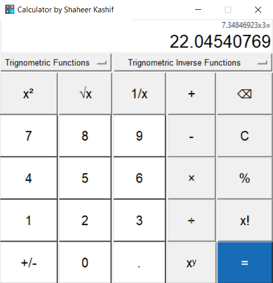

# CalcPy
My Second Project which includes a Mathematical Calculator made with TKinter.

## Installation For Source Code
1. Clone This Repository to your machine
2. Create a Python virtual environment (optional but recommended) using Command Prompt in the Repository   Folder:
```python -m venv venv```
3. Done!

## Just Want to Play around with the Software?
Download calcepy.rar in the build folder, extract it and launch calc.exe!

## Screenshot of the Software:-
